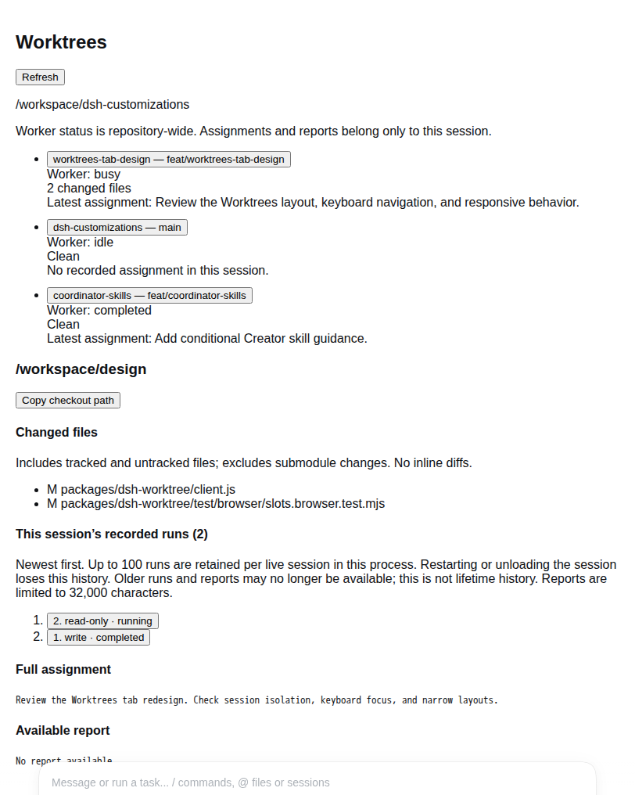
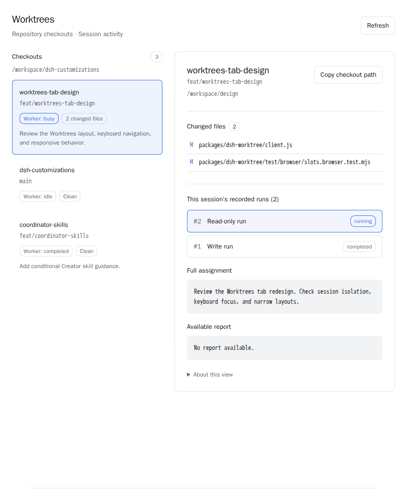
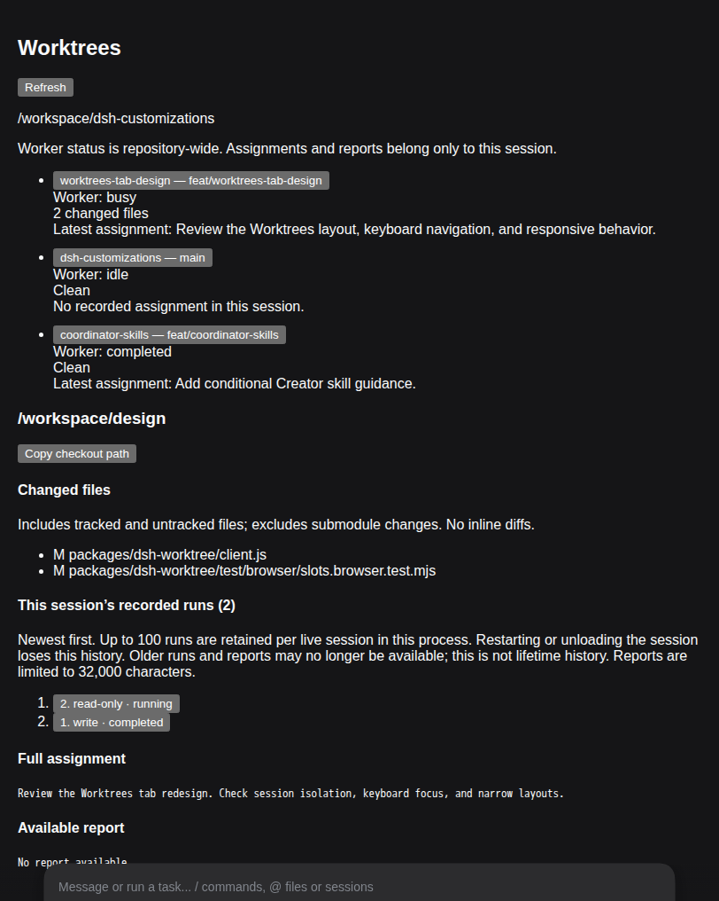
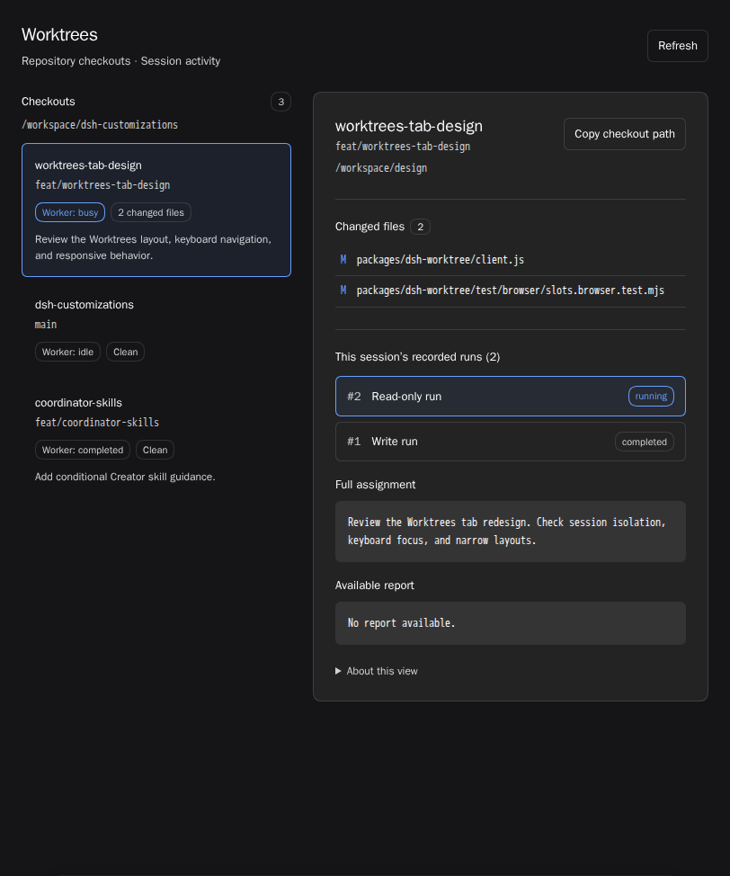
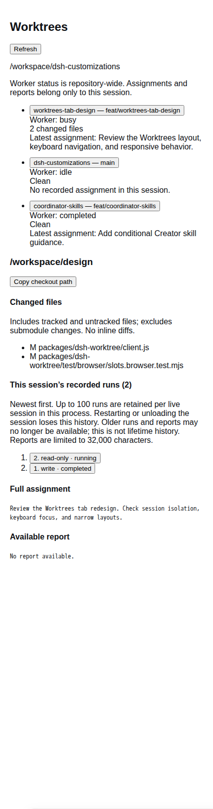
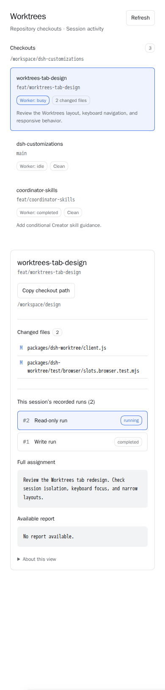

# Worktrees visual regression tests

These tests mount the real Worktrees client in a disposable DSH shell. They select the actual light/dark themes and provide deterministic RPC snapshots. They do not verify live Git state, capability authorization, or RPC transport; separate Node tests cover those contracts.

Run `node node_modules/@playwright/test/cli.js test packages/dsh-worktree/test/real-ui/worktrees.spec.mjs` in the pinned Linux ARM64 Playwright container documented in the root README. Normal runs compare against committed PNGs with zero allowed pixel differences. CI runs these tests automatically and uploads expected/actual/diff evidence on failure. Update snapshots only when a visual change is intended and reviewed.

The narrow case constrains the slot to 390 pixels inside the actual shell. This checks the container-query layout, not mobile sidebar behavior. The normal shell composer remains visible; screenshots do not hide production UI elements.

## Before/after comparison

For local review only, set `WORKTREES_BEFORE_REF` to a trusted Git revision containing the earlier client. The same test replaces only that exact client source in the disposable browser's combined plugin response and writes images under `artifacts/worktrees-before/`. It does not change repository source or the running DSH instance. This mode is rejected in CI and does not perform baseline comparisons. Git reads use command-scoped trust for the exact checkout, not global configuration.

The `comparison/` images record the pre-redesign client at `00b8f09`; they are review evidence, not CI baselines. The images under `worktrees.spec.mjs-snapshots/` are the expected redesigned view used by CI.

| Layout | Before | After (CI baseline) |
| --- | --- | --- |
| Light |  |  |
| Dark |  |  |
| Narrow |  |  |
